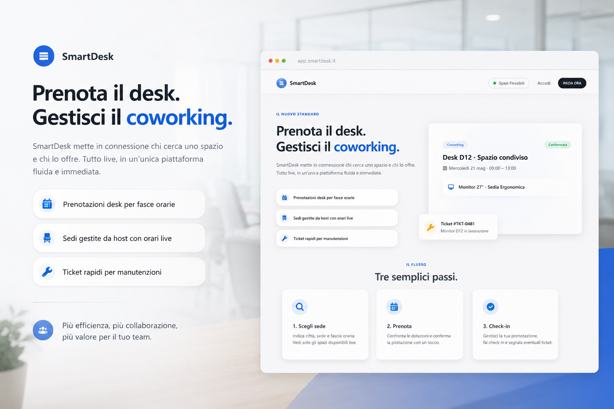

# SmartDesk

**Progetto finale di tesi di laurea — Ingegneria del Software**  
Politecnico di Milano

| Nome | Matricola |
|------|-----------|
| Cesandri | 248170 |
| Gheojan | 247840 |

---

## Il progetto

SmartDesk è una piattaforma di coworking che ha l'obiettivo di mettere in contatto chi vuole rendere disponibili i propri spazi con chi cerca un posto dove lavorare in tranquillità.

Chi gestisce una sede può pubblicare i proppri uffici fornendo la disponibilità di uno o più desk, indicando orari di apertura e chiusura e dotazioni.

Chi cerca uno spazio può facilmente sfogliare le sedi, prenotare una postazione per la fascia oraria che preferisce e segnalare problemi tramite ticket di manutenzione.
---

## Stack

| Layer | Tecnologie |
|-------|------------|
| Frontend | Angular 21, TypeScript, Bootstrap 5 |
| Backend | Java 17, Spring Boot 4, Spring Security, JWT |
| Database | MySQL |
| Build | Maven (backend), npm (frontend) |
